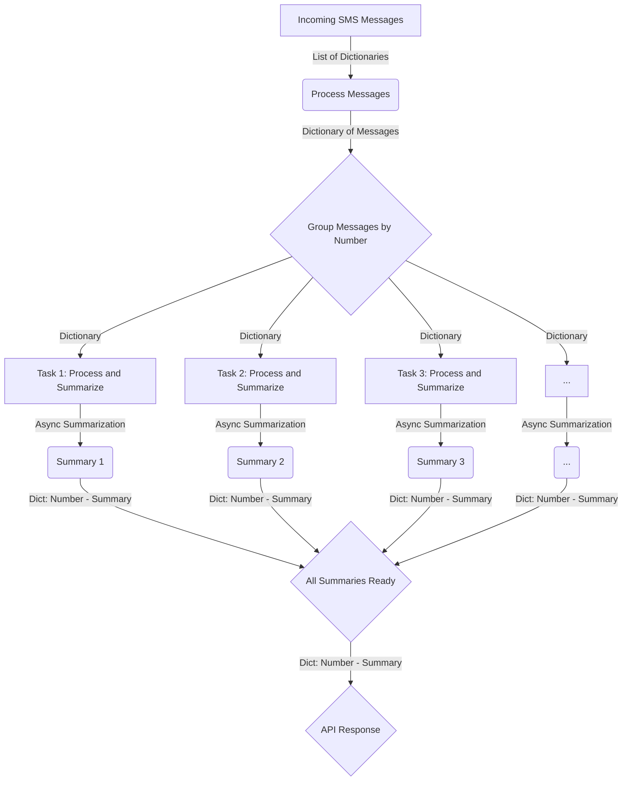

  SMS Text Summarizer

SMS Text Summarizer
===================

This is a service designed to process SMS messages, extract useful information, and generate summaries for each conversation thread. It leverages natural language processing (NLP) techniques to identify key information and provide concise summaries.

Installation
------------

1.  Clone the repository:
    ```bash
    git clone https://github.com/SMS-TEXT-SUMMARIZER/Backend.git
    ```
3.  Navigate to the project directory:
    ```bash
    cd Backend
    ```
5.  Install dependencies:
    ```bash
    pip install -r requirements.txt
    ```
Usage
-----

1.  Run the FastAPI server:
    ```bash
    uvicorn main:app --reload
    ```
This will start the server on `http://localhost:8000` by default.

4.  Test the APIs using tools like `curl` or Swagger UI.



Contributing
------------

Contributions are welcome! Please feel free to open issues or submit pull requests to improve the functionality, documentation, or code quality.

License
-------

This project is licensed under the MIT License - see the [LICENSE](LICENSE) file for details.
